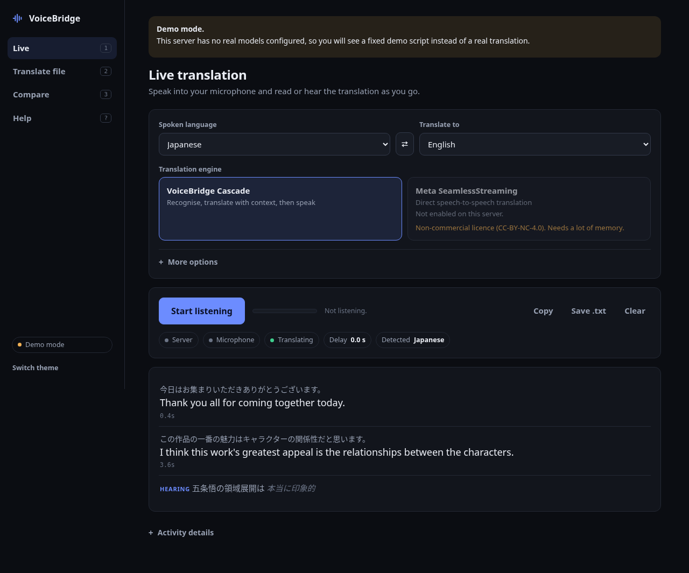
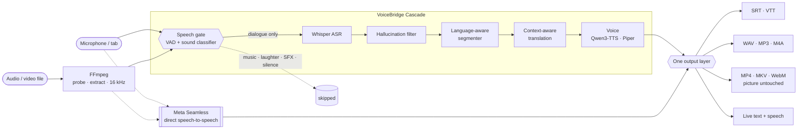
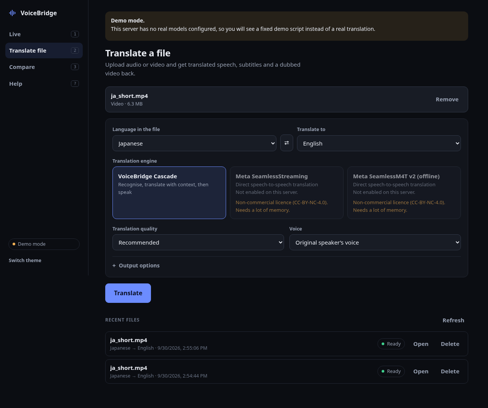
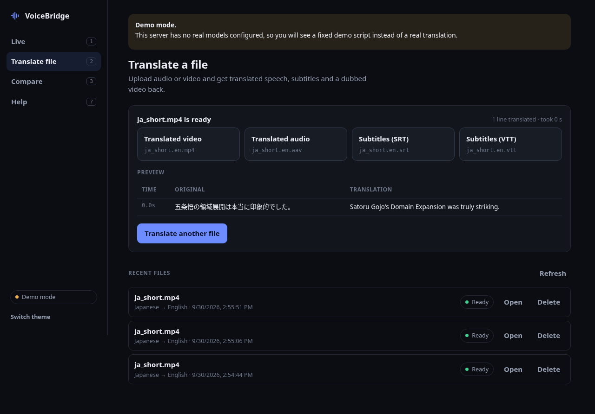
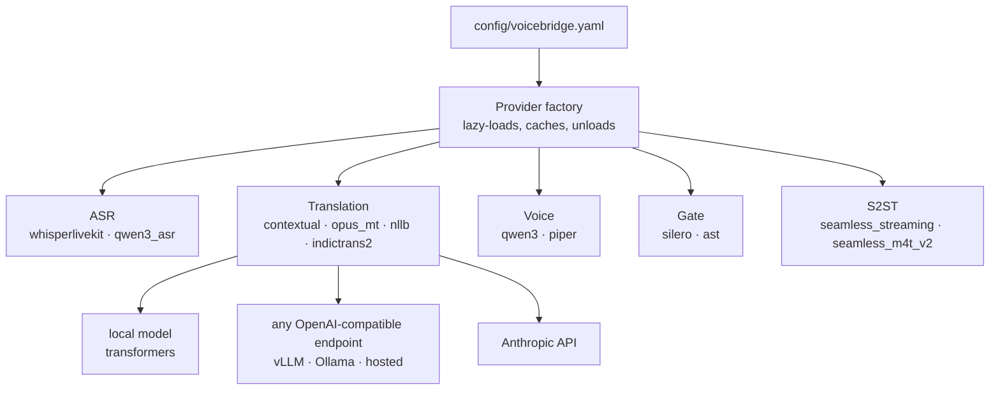

<div align="center">

# ◢◤ VoiceBridge

### Speech in. Another language out. Live or from a file.

**Self-hosted speech-to-speech translation** that listens, understands what is dialogue and what is noise,<br>
translates with the conversation in mind, and answers in a voice, as subtitles, or as a dubbed video.

[](LICENSE)
[](#-quick-start)
[](#-known-limitations)
[](#-quick-start)
[](docs/evaluation.md)

`Japanese → English` · `Korean → English` · `English → Hindi` · *any pair your models support*



</div>

---

## ⟁ Signal path



Two engines, one output layer. You choose the engine per session or per file, and
VoiceBridge **never switches engines behind your back**: if the one you picked
fails, it says so.

## ⟁ What it does

<table>
<tr>
<td width="50%" valign="top">

**🎙 Live translation**<br>
Speak, read the translation as it forms, hear it spoken. Browser page for the
microphone, Chrome extension for a tab.

**🎬 File translation**<br>
Drop in audio or video. Get translated speech, SRT/VTT subtitles and a dubbed
video whose picture stream is copied bit for bit.

**🧠 Translation that remembers**<br>
An LLM sees the previous lines, your glossary and your honorific policy, so
「彼には言わないで」 knows who "him" is.

</td>
<td width="50%" valign="top">

**🚧 A gate before the recogniser**<br>
Music, laughter, crying, explosions and silence are classified and skipped.
Dialogue over a soundtrack is kept.

**🧹 A filter after it**<br>
Text the recogniser probably invented ("Thanks for watching" over silence) is
dropped before it is translated or spoken.

**🗣 The speaker's own voice**<br>
Qwen3-TTS clones each speaker from the source audio, and each line is fitted
to the time the original took.

</td>
</tr>
</table>

Also in the box: async jobs with live progress, cancel and delete · a glossary and
`preserve / naturalize / remove` honorific modes · Japanese/Korean segmentation
that waits for the sentence-final verb · mock mode with no models at all · a
benchmark suite that records its own environment.

## ⟁ Supported languages

| Direction | Cascade | Meta Seamless |
| --- | --- | --- |
| Japanese → English | Whisper → translator → Qwen3-TTS | yes |
| Korean → English | Whisper → translator → Qwen3-TTS | yes |
| English → Hindi | Whisper → OPUS-MT (or a larger LLM, or IndicTrans2) → **Piper** (Qwen3-TTS has no Hindi) | yes |
| anything else | any pair your recognition, translation and voice providers cover | its 36 speech targets |

Nothing about these pairs is hard-coded. `GET /api/v1/models/languages` lists
what a server is configured for.

## ⟁ Measured, not promised

Everything below was measured on one CPU-only laptop-class machine (16 threads,
14 GB RAM, no GPU). Full method, data and caveats: **[docs/evaluation.md](docs/evaluation.md)**.

| Question | Measured answer |
| --- | --- |
| Does Whisper invent text on non-speech? | Yes: on **8 of 8** clips (laughter, music, silence…). With the speech gate: **0 of 8**. |
| Is the LLM translator better than OPUS-MT? | **Depends.** A 4B model wins on FLEURS ja/ko→en (chrF 56 vs 50) and Korean dialogue; OPUS-MT wins on a Japanese dialogue set; a 1.7B model is far worse for Hindi. |
| Does context help? | Yes for the LLMs: Korean dialogue chrF 45.7 → 56.2 with context (1.7B model). |
| How fast are files on CPU? | About 4× the file's length with the full cascade. |
| How far behind is live on CPU? | 9–19 s. **The 1–2 s design target is not met without a GPU**, and GPU behaviour has not been measured yet. |
| Can this machine run SeamlessStreaming? | Barely: 10–12.5 GB of RAM, 18–37× slower than real time. |

## ⟁ Quick start

```bash
git clone https://github.com/sanketwork300-hash/voicebridge
cd voicebridge
python -m venv .venv && source .venv/bin/activate
pip install -e .
voicebridge-gateway          # or: voicebridge serve · python -m voicebridge
```

Open <http://127.0.0.1:8000>. This is **demo mode**: the interface, jobs and
FFmpeg rendering all work, but no real model runs and the transcript is a fixed
script. For real translation:

```bash
pip install --index-url https://download.pytorch.org/whl/cpu torch torchaudio
pip install -e '.[asr,speech-gate,translation,tts,media,benchmark]'
scripts/setup_workers.sh qwen          # isolated environment for Qwen3-TTS / Qwen3-ASR
VOICEBRIDGE_CONFIG=config/examples/cascade-cpu.yaml voicebridge-gateway
```

| Ready-made config | Use it for |
| --- | --- |
| `config/examples/cascade-cpu.yaml` | Files, full quality: Whisper large-v3-turbo, gate with classifier, contextual LLM, Qwen3-TTS |
| `config/examples/live-cpu.yaml` | Live on a CPU: Whisper `small`, VAD-only gate, Piper voice |
| `config/examples/seamless-cpu.yaml` | Meta Seamless engines, with no cascade model loaded |

## ⟁ The interface

 

One self-contained page, no build step, light and dark themes, works on a
phone. It is designed against **Jakob Nielsen's ten usability heuristics**:

| Heuristic | In VoiceBridge |
| --- | --- |
| Visibility of system status | Server pill, microphone level meter, per-stage progress with a time estimate |
| Match with the real world | "Translate file", "Original speaker's voice": no model jargon up front |
| User control and freedom | Stop, cancel, remove file, clear, delete job; you can leave and come back to a running job |
| Consistency and standards | One button style per role; the same engine picker in both views |
| Error prevention | Files are checked before upload; Translate stays disabled and says why; two-step confirm for cancel and delete |
| Recognition rather than recall | Options are visible, your last settings are remembered, recent files are listed |
| Flexibility and efficiency | Drag and drop, keyboard shortcuts (`1` `2` `3` `?` `Space`), advanced options folded away |
| Aesthetic and minimalist design | One accent colour; details only on demand |
| Help users recover from errors | Every error says what happened and what to do; "Retry with VoiceBridge Cascade" is a button, never automatic |
| Help and documentation | Built-in Help view and inline hints |

### Live translation

1. Start VoiceBridge and open <http://127.0.0.1:8000>.
2. In **Live**, choose the spoken language and the language to translate to.
3. Pick an engine: **VoiceBridge Cascade** or **Meta SeamlessStreaming**.
4. Press **Start listening** and speak.

To translate a *browser tab* instead of the microphone, load the extension:
`chrome://extensions` → Developer mode → **Load unpacked** → `apps/browser-extension/`,
then click the VoiceBridge icon on the tab you want. VoiceBridge only translates
audio the browser already exposes to it; it does not bypass DRM, logins or paywalls.

### File translation

1. Open **Translate file** and drop in a `.wav .mp3 .m4a .flac .ogg .mp4 .mkv .mov .webm`.
2. Check the languages, engine, quality and voice.
3. Press **Translate**, watch the stages, download the results.

`input.mp3` → `input.en.mp3`, `input.en.wav`, `input.en.srt`, `input.en.vtt`<br>
`movie.mp4` → `movie.en.mp4` (dubbed, subtitles embedded), `movie.en.srt`, `movie.en.vtt`

Without a browser:

```bash
voicebridge --config config/examples/cascade-cpu.yaml translate-file input.mp3 \
    --source ja --target en --out ./translated

curl -F file=@input.mp3 -F source_language=ja -F target_language=en \
     http://127.0.0.1:8000/api/v1/files/translate        # → {"job_id": "…", "status": "queued"}
```

Long media is never held in memory whole: uploads stream to disk, audio is
decoded to a file, and every stage reads regions of it.

<details>
<summary><b>Video output options</b></summary>

For `movie.mp4` → `movie.en.mp4` (dubbed, with embedded English subtitles),
`movie.en.srt`, `movie.en.vtt`, and optionally `movie.en.subtitled.mp4`
(original audio + English subtitles) and `movie.en.wav`.

The video stream is **copied, not re-encoded**, so resolution, frame rate,
quality and duration are preserved. Audio options:

| `audio_mode` | Result |
| --- | --- |
| `replace` | translated speech only |
| `keep` | translated track (default) + original as a second selectable track |
| `mix` | one track: translated speech over the original at `original_gain` (0.25) |

MKV input produces MKV (SubRip subtitles) and WebM produces WebM (Opus audio,
WebVTT). MP4/MOV produce MP4 (`mov_text`).

</details>

## ⟁ Switch models, plug in a GPU or an API

Every model sits behind a provider interface and is chosen in one YAML file.



| You want to… | Do this |
| --- | --- |
| Use a GPU | Install the CUDA builds ([GPU setup](#gpu-setup)); `runtime.device: auto` picks it up |
| Put only the translator on a cloud GPU | Serve a model with vLLM there, set `backend: openai` and `base_url` |
| Use a hosted LLM | `backend: openai` with your endpoint, or `backend: anthropic` |
| Let users pick quality | Map `fast / balanced / high_quality` to models in `translation_presets` |
| Use a different model for one language | `translation_by_target: {hi: {provider: opus_mt}}` |

The API backends are implemented but have **not been run against a live
endpoint yet**; speech recognition and voice have no remote-API provider so far.

<details>
<summary><b>Full configuration reference</b></summary>

One YAML file (`config/voicebridge.yaml`, or the path in `VOICEBRIDGE_CONFIG`).
Environment variables override it. The shipped default is mock mode;
[`config/examples/cascade-cpu.yaml`](config/examples/cascade-cpu.yaml) is the
real CPU configuration used for the evaluation.

### Cascade

```yaml
pipeline:
  mode: cascade                 # cascade | seamless_streaming | benchmark

runtime:
  device: auto                  # auto -> cuda, then mps, then cpu
  dtype: auto                   # fp16/bf16 on GPU; bf16 on CPUs with AVX-512-BF16
  warmup: [asr]                 # loaded at startup; everything else loads on first use
  low_memory: false             # true: file jobs free the LLM before TTS

honorific_policy:
  mode: preserve                # preserve | naturalize | remove

glossary:
  - source: "五条先生"
    target: "Gojo-sensei"

providers:
  asr:
    provider: whisperlivekit
    model: openai/whisper-large-v3-turbo
    backend_policy: localagreement
  speech_gate:
    enabled: true
    vad: silero
    event_classifier: ast
    dialogue_threshold: 0.35    # dialogue score that always passes (even over music)
    non_speech_threshold: 0.60  # confident music/SFX/laughter/... is skipped
    transcribe_unknown: true    # uncertain audio still goes to ASR
  translation:
    provider: contextual
    backend: transformers       # transformers | openai | anthropic
    model: Qwen/Qwen3-1.7B
    context_segments: 8
    context:
      max_tokens: 2048
    validation: balanced        # strict | balanced | fast
  translation_by_target:        # per-language override, driven by benchmark results
    hi: {provider: opus_mt}     # Qwen3-1.7B measured far worse than OPUS-MT for en->hi
  translation_presets:          # the UI's Fast / Balanced / High Quality
    fast:         {provider: opus_mt}
    balanced:     {provider: contextual, backend: transformers, model: Qwen/Qwen3-1.7B}
    high_quality: {provider: contextual, backend: transformers, model: Qwen/Qwen3-4B-Instruct-2507}
  tts:
    provider: qwen3
    model: Qwen/Qwen3-TTS-12Hz-1.7B-Base
    default_voice: source       # clone each speaker from the source audio
    voices:                     # optional named reference voices
      narrator: {ref_audio: voices/narrator.wav, ref_text: "transcript of that clip"}
    timing: {enabled: true, max_rate: 1.20, min_rate: 0.85, duration_tolerance: 0.15}
  fallback_tts:                 # languages the primary TTS lacks (Hindi)
    provider: piper
    voices: {hi: models/piper/hi_IN-priyamvada-medium.onnx}
```

The contextual provider against an API instead of a local model:

```yaml
  translation:
    provider: contextual
    backend: openai                       # vLLM, llama.cpp server, Ollama, OpenAI...
    base_url: http://127.0.0.1:8080/v1
    model: your-model-name
    api_key_env: VOICEBRIDGE_LLM_API_KEY  # read from the environment
```

```yaml
  translation:
    provider: contextual
    backend: anthropic                    # pip install 'voicebridge[translation-api]'
    model: claude-opus-5-5                # credentials: ANTHROPIC_API_KEY or `ant auth login`
    effort: low
```

Older configurations keep working: `provider: opus_mt` / `nllb` / `indictrans2`
/ `piper` / `mock` are unchanged, and mock mode is still the default.

### SeamlessStreaming

```yaml
pipeline:
  mode: seamless_streaming      # default engine when a session/job names none; the UI can still pick
providers:
  s2st:
    seamless_streaming:
      enabled: true             # required: an explicit licence acknowledgement
      model: facebook/seamless-streaming   # HF repo whose .pt files are used if present
      device: auto              # auto | cpu | cuda:0
      dtype: auto               # fp16 on CUDA, fp32 on CPU (the agent pipeline's own rule)
      segment_ms: 320           # audio pushed per step (Meta's evaluation default)
      decision_threshold: 0.5   # monotonic decoder emit threshold (Meta's default)
      threads: 0                # torch CPU threads (0 = library default)
      idle_unload_seconds: 600  # stop the worker (free memory) after idling
      python: null              # worker interpreter; default .venv-workers/seamless
    seamless_m4t_v2:
      enabled: true
      model: facebook/seamless-m4t-v2-large
```

</details>

<details>
<summary><b>Downloading models ahead of time</b></summary>

Models come from Hugging Face on first use (cache: `~/.cache/huggingface`).
To pre-fetch:

```bash
hf download mobiuslabsgmbh/faster-whisper-large-v3-turbo   # ASR (MIT)
hf download MIT/ast-finetuned-audioset-10-10-0.4593        # speech gate (BSD-3)
hf download Qwen/Qwen3-1.7B                                # translation, balanced (Apache-2.0)
hf download Qwen/Qwen3-4B-Instruct-2507                    # translation, high quality (Apache-2.0)
hf download Helsinki-NLP/opus-mt-ja-en Helsinki-NLP/opus-mt-ko-en   # fast fallback
hf download Qwen/Qwen3-TTS-12Hz-1.7B-Base Qwen/Qwen3-TTS-Tokenizer-12Hz   # TTS (Apache-2.0)
hf download Qwen/Qwen3-ASR-1.7B                            # optional ASR (Apache-2.0)
```

Piper voices (each voice has its own licence; check the `MODEL_CARD`):

```bash
mkdir -p models/piper && cd models/piper
curl -LO https://huggingface.co/rhasspy/piper-voices/resolve/main/hi/hi_IN/priyamvada/medium/hi_IN-priyamvada-medium.onnx
curl -LO https://huggingface.co/rhasspy/piper-voices/resolve/main/hi/hi_IN/priyamvada/medium/hi_IN-priyamvada-medium.onnx.json
```

Meta Seamless weights are **never** downloaded automatically. See
[SeamlessStreaming mode](#-meta-seamlessstreaming-mode).

</details>

## ⟁ Meta SeamlessStreaming mode

> ⚠ **Licence.** The published SeamlessStreaming / SeamlessM4T v2 weights are
> **CC-BY-NC-4.0** (non-commercial). Supported here for research, evaluation,
> benchmarking, and as an explicitly selected engine. **Review the licence
> before any commercial deployment.** VoiceBridge doesn't bundle or
> auto-download these weights.

1. Install the worker environment: `scripts/setup_workers.sh seamless`
   (Python 3.10, torch 2.1.1, fairseq2 0.2.1, seamless_communication, SimulEval).
2. Download the model, as your own explicit action, after reading the licence:
   `hf download facebook/seamless-streaming --include "*.pt" --include "*.model"`
   (and, for the offline reference engine,
   `hf download facebook/seamless-m4t-v2-large --include "*.safetensors" --include "*.json" --include "*.model"`).
3. Set `providers.s2st.seamless_streaming.enabled: true` (see
   [Configuration](#seamlessstreaming)), or start from
   [`config/examples/seamless-cpu.yaml`](config/examples/seamless-cpu.yaml),
   which loads no cascade model at all.
4. Start VoiceBridge and choose **Meta SeamlessStreaming** as the
   engine in either Live or Translate file.
5. Pick source and target languages, then start.

In this mode VoiceBridge doesn't run Whisper, the contextual translator or
Qwen3-TTS. Audio goes straight to Meta's streaming agent
(`SeamlessStreamingS2STJointVADAgent`, with its own Silero VAD). If it fails,
the session or job fails with `SEAMLESS_MODEL_ERROR` and the reason. It
**never** switches to the cascade silently.

**Timing honesty.** SeamlessStreaming doesn't align its output to source
timestamps. VoiceBridge records the *emission offset* (how much source audio
had been consumed when each piece was produced) and labels segments
`timing: emission_offset`. File outputs place speech at those offsets, which
is what a live listener hears. SeamlessM4T v2 (offline) translates per
speech-gate region and carries that region's source timestamps.

## ⟁ Benchmarking

```bash
# datasets: FLEURS (CC-BY-4.0) is sentence-parallel, so the English reading of
# the same sentence id is a human reference translation
python -m voicebridge.benchmark.datasets fleurs --source ja --target en -n 20 \
    --out benchmark/datasets/ja_en.json

# component benchmarks (no winner is declared)
python -m voicebridge.benchmark --dataset benchmark/datasets/ja_en.json \
    --config config/examples/cascade-cpu.yaml \
    --components asr,translation,tts \
    --asr whisperlivekit,qwen3_asr \
    --translation opus_mt,contextual:Qwen/Qwen3-1.7B,contextual:Qwen/Qwen3-4B-Instruct-2507 \
    --tts piper,qwen3 --output benchmark/results/ja_en

# cascade vs SeamlessStreaming on byte-identical input
python -m voicebridge.benchmark.compare --input ./samples/test.wav --source ja --target en \
    --config config/examples/cascade-cpu.yaml --realtime
python -m voicebridge.benchmark.compare --dataset benchmark/datasets/ja_en.json

# hardware / software / model load cost
python -m voicebridge.benchmark.resources --load asr,translation,tts \
    --config config/examples/cascade-cpu.yaml
```

Reports go to `benchmark/results/…/benchmark.{json,csv,md}` (compare:
`comparison.{json,md}` plus each engine's output audio/subtitles). Every report
records commit SHA (and whether the tree was dirty), Python, PyTorch, CUDA,
GPU, CPU, RAM, OS, FFmpeg, package versions, configuration, dataset version and
timestamp. The web page's **Compare** view shows these files and nothing
else.

Metrics: WER, CER, language-ID accuracy, hallucination rate (accepted text on
non-speech clips), BLEU, chrF, COMET (with `pip install unbabel-comet` and
`--comet`), TTS RTF and round-trip WER/CER (the synthesised audio transcribed
back), TTFT, TTFA, segment latency P50/P95, RTF, duration ratio, silence ratio,
clipping, peak/mean RSS, and peak/mean VRAM on CUDA. No single automatic metric
is treated as definitive.

Test media builders: `scripts/make_test_media.py` (FLEURS speech + synthetic
music/noise, with a ground-truth JSON) and `scripts/fetch_nonspeech.py` (freely
licensed laughter, crying, applause and singing from Wikimedia Commons, with an
attribution file).

## ⟁ Hardware

These are *starting points*. Real requirements depend on the model, precision,
quantisation, audio length, concurrency, batch size and CUDA version. Measure
your setup with `python -m voicebridge.benchmark.resources --load …`.

**Minimum CPU development environment**: 4+ cores, 8–16 GB RAM, 20+ GB disk
(depending on models), GPU optional. CPU-only execution is **substantially
slower**: on the 16-core, 14 GB development machine, the cascade with
Qwen3-TTS processed files at several times *slower* than real time (see
[docs/evaluation.md](docs/evaluation.md)). Qwen3-TTS alone ran around RTF 5 in
bf16. Use Piper TTS or subtitles-only output for faster CPU runs.

**Development / cascade (GPU)**: NVIDIA GPU with 8–12 GB VRAM, 16–32 GB system
RAM, SSD.

**Higher-quality local deployment**: NVIDIA GPU with 16–24+ GB VRAM (room for a
larger translation LLM), 32+ GB RAM, NVMe SSD.

**Measured on the development machine (16 threads, 14 GB RAM, no GPU):** file
cascade RTF 3.7–4.5; live cascade 9–19 s behind the speaker; SeamlessStreaming
needed 10.5–12.5 GB resident and ran at RTF 18–37. **Do not run
SeamlessStreaming on a machine with less than ~16 GB of free RAM**: here the
kernel OOM killer fired. Model workers now stop themselves with a clear error
when RAM + swap headroom drops below 1.5 GB
(`VOICEBRIDGE_WORKER_MEMORY_RESERVE_MB`), but in-process models (the
translation LLM, SeamlessM4T v2) are not guarded.

**SeamlessStreaming**: the memory needed depends on the selected Seamless
model, precision and implementation. The checkpoints alone are about 3.6 GB
(UnitY) + 4.3 GB (monotonic decoder) + 0.17 GB (vocoder) on disk, and the
agent pipeline loads fp32 on CPU. See docs/evaluation.md for what was measured
here. No VRAM figure is guaranteed.

Configuration profiles (`runtime.profile`, or `VOICEBRIDGE_RUNTIME_PROFILE`)
are defaults, not claims that a model fits:

```yaml
runtime_profiles:
  cpu:      {device: cpu, low_memory: true}
  gpu_8gb:  {device: cuda, max_concurrency: 1}
  gpu_16gb: {device: cuda, max_concurrency: 1}
  gpu_24gb: {device: cuda, max_concurrency: 2}
```

### GPU setup

```bash
pip install --index-url https://download.pytorch.org/whl/cu121 torch torchaudio
TORCH_INDEX=https://download.pytorch.org/whl/cu121 scripts/setup_workers.sh qwen
FS2_INDEX=https://fair.pkg.atmeta.com/fairseq2/whl/pt2.1.1/cu121 scripts/setup_workers.sh seamless
```

With `runtime.device: auto`, CUDA is used when present, then Apple MPS, then CPU.
With `dtype: auto`, CUDA uses bf16 where supported (else fp16) and CPU uses
bf16 only when the CPU has native BF16 support. At startup VoiceBridge logs
`GPU acceleration unavailable. Translation may be significantly slower.` when it
falls back to CPU. Docker: `docker compose -f deploy/compose/docker-compose.yml
--profile gpu up`.

## ⟁ API

<details>
<summary><b>Endpoints, job statuses and error codes</b></summary>

| Endpoint | Purpose |
| --- | --- |
| `POST /api/v1/files/upload` | Upload a file → `upload_id` |
| `POST /api/v1/files/translate` (alias `POST /api/v1/translate/file`) | Start a job from `file` or `upload_id`. Form fields: `source_language`, `target_language`, `engine` (`cascade`/`seamless_streaming`/`seamless_m4t_v2`), `output_format`, `outputs` (`audio,video,srt,vtt,subtitled_video`), `audio_mode`, `voice`, `translation_quality`, `translation_provider`, `tts_provider`, `subtitle_enabled`, `dual_subtitles`, `synthesize`, `honorifics`, `glossary` (JSON), `style` → `202 {"job_id","status":"queued"}` |
| `GET /api/v1/jobs` / `GET /api/v1/jobs/{id}` | Status, `progress`, `stage`, `eta_seconds`, outputs, error, log (engine, models, device, dtype, duration) |
| `GET /api/v1/jobs/{id}/events` | Server-Sent Events: `job.progress` + pipeline events |
| `WS /api/v1/jobs/{id}/ws` | Same events over WebSocket |
| `POST /api/v1/jobs/{id}/cancel` | Cancel (workers check between units of work) |
| `DELETE /api/v1/jobs/{id}` | Cancel if running, then delete the upload, outputs and record. Finished jobs are also deleted automatically after `media.retention_hours` (72) |
| `GET /api/v1/jobs/{id}/outputs[/{name}]` | List / download artifacts |
| `POST /api/v1/realtime/sessions` (legacy `/v1/sessions`) | Create a live session (`engine: cascade`/`seamless_streaming`) |
| `WS /api/v1/realtime/sessions/{id}/stream` | Audio in, events out ([docs/protocol.md](docs/protocol.md)) |
| `GET /api/v1/models` | Model matrix with licences |
| `GET /api/v1/models/engines` | Selectable engines, enabled state, licence notices |
| `GET /api/v1/models/options` | Quality presets, voices, audio modes |
| `GET /api/v1/models/providers`, `/api/v1/models/languages` | Provider capabilities, language pairs |
| `GET /api/v1/benchmarks` | Benchmark reports found on the server |
| `GET /api/v1/health[/live|/ready|/metrics]` | Liveness, readiness, Prometheus metrics |

Job statuses are `queued`, `preprocessing`, `speech_detection`, `transcribing`,
`translating`, `synthesizing`, `rendering`, `completed`, `failed` and
`cancelled`. Errors are structured as `{"stage", "code", "message",
"retryable"}` and never include stack traces. Codes include `FFMPEG_MISSING`,
`CORRUPTED_MEDIA`, `NO_AUDIO_STREAM`, `MEDIA_TOO_LONG`, `PROVIDER_UNAVAILABLE`,
`ASR_FAILED`, `TRANSLATION_FAILED`, `TTS_UNAVAILABLE`, `SEAMLESS_MODEL_ERROR`,
`NO_DIALOGUE_DETECTED`, `PROCESSING_TIMEOUT`, `JOB_CANCELLED` and
`INTERNAL_ERROR`. Upload rejections: `400` for a bad type, `413` when too
large, `415` when the content doesn't match the extension, and `507` when the
disk quota is exhausted.

Security: set `VOICEBRIDGE_API_TOKEN` (sent as `Authorization: Bearer …` or
`?token=`) and `VOICEBRIDGE_WS_ORIGINS` for any non-localhost bind. See
[docs/security.md](docs/security.md).

</details>

## ⟁ Architecture

**Real-time.** Capture → `TranslationPipeline`. The gate decides per 0.6 s
window; rejected windows go to the recogniser as *silence of equal length* so
timestamps never drift. Stable text is segmented, validated, translated with
context, validated again, spoken, and played in order. On stop, the pipeline
drains (recogniser → translation → voice) before the socket closes.

**Files.** Upload → checks (type, content signature, size, quota) → job queue →
worker: probe → extract to 16 kHz → speech detection over the whole file →
recognition in dialogue-shaped chunks cut at pauses → one translation context
for the whole file → each spoken line placed at its original timestamp on a
disk-backed timeline → subtitles, audio, video.

**Model workers.** Qwen3 and Seamless pin dependencies that cannot share the
gateway's environment, so each runs in its own virtualenv behind a small
JSON-lines protocol. That also makes a model unloadable (stop the process),
keeps a native crash away from the gateway, and lets a memory guard stop a
worker before the operating system has to.

```
voicebridge/
├── api/            REST: files, jobs, models, engines, benchmarks
├── apps/gateway/   FastAPI app, WebSocket sessions, the web page (static/index.html)
├── core/
│   ├── pipeline/   realtime · file · S2ST pipelines, speech gate, translate + voice steps
│   ├── asr_validation/ · validation/    hallucination filter · translation checks
│   ├── context/ · segmentation/         glossary, honorifics, rolling context · ja/ko segmenter
│   └── jobs/       queue, manager, executor, structured errors
├── providers/      asr · translation · tts · vad · audio_events · s2st · factory
├── workers/        isolated model processes + protocol + memory guard
├── media/          probe, extract, render, mux, subtitles (FFmpeg)
├── storage/        artifact store (local filesystem today)
└── benchmark/      datasets, metrics, runners, reports
```

More: [docs/architecture.md](docs/architecture.md) · [docs/protocol.md](docs/protocol.md) · [docs/security.md](docs/security.md)

## ⟁ Troubleshooting

| Symptom | Cause / fix |
| --- | --- |
| `FFMPEG_MISSING` | Install FFmpeg, or set `media.ffmpeg_path` / `VOICEBRIDGE_FFMPEG` |
| Subtitles in mock mode are unrelated to what you said | Mock providers; switch to real providers |
| `whisperlivekit is not installed` on Python 3.14 | Use Python 3.11–3.13 |
| Very slow jobs, heavy swapping | Too many models resident on a small-RAM host: set `runtime.low_memory: true`, `tts.idle_unload_seconds`, use `translation_quality: fast`, or Piper TTS |
| `Qwen3-TTS Base needs a reference voice` | Use voice `source` (clone the original speaker) or configure `tts.voices.<name>.ref_audio` |
| `Qwen3-TTS does not support language 'hi'` | Configure `fallback_tts` (Piper with a Hindi voice) |
| `qwen3-tts worker interpreter not found` | Run `scripts/setup_workers.sh qwen`, or set `providers.tts.python` |
| `SEAMLESS_MODEL_ERROR … system memory nearly exhausted` | The Seamless worker needs more RAM than is free (fp32 on CPU: 10–12.5 GB). Use a bigger machine or a GPU; `seamless_m4t_v2` (offline) needs less |
| `SEAMLESS_MODEL_ERROR … disabled` | Set `providers.s2st.seamless_streaming.enabled: true` after reviewing the licence |
| `NO_DIALOGUE_DETECTED` | The speech gate found no dialogue (music/SFX only, or silence); lower `speech_gate.dialogue_threshold` if that's wrong |
| Translation ignores honorific preference | Small local LLMs often ignore instructions; the unambiguous-title heuristic still applies. A larger model (`high_quality`) or an API backend follows the policy better |

More in [docs/troubleshooting.md](docs/troubleshooting.md).

## ⟁ Model licences

Checked on the model cards for the versions named. Model *weights* often have a
different licence from the code that runs them.

| Component | Model | Purpose | Default | Licence / notes |
| --- | --- | --- | --- | --- |
| ASR | Whisper large-v3-turbo | Speech recognition | Yes | MIT |
| ASR | Qwen3-ASR-1.7B | Alternative ASR | Optional | Apache-2.0 |
| VAD | Silero VAD v6 (bundled in faster-whisper) | Voice activity | Yes | MIT |
| Audio events | MIT/ast-finetuned-audioset-10-10-0.4593 | Dialogue vs non-speech | Yes | BSD-3-Clause |
| Translation | OPUS-MT (Helsinki-NLP) | Fast local translation | Fallback / "fast" | Apache-2.0 (verify per pair) |
| Translation | Contextual provider | Context-aware translation | Preferred | Depends on the backend: Qwen3-1.7B / Qwen3-4B-Instruct-2507 are Apache-2.0; API services have their own terms |
| Translation | NLLB-200 distilled 600M | Multilingual research backend | Optional (research) | **CC-BY-NC-4.0** |
| Translation | IndicTrans2 | English ↔ Indic | Optional | MIT |
| TTS | Piper | Lightweight TTS, Hindi fallback | Fallback | Engine: **piper-tts ≥ 1.3 is GPL-3.0-or-later**. Voices: per voice. The `en_US-lessac` and all `hi_IN` voices checked are research / **CC-BY-NC-SA** |
| TTS | Qwen3-TTS-12Hz-1.7B-Base | Higher-quality voice-cloning TTS | Preferred | Apache-2.0 |
| S2ST | Meta SeamlessStreaming | Direct speech translation | Optional | **CC-BY-NC-4.0** weights (code MIT) |
| S2ST | Meta SeamlessM4T v2 large | Offline reference | Optional | **CC-BY-NC-4.0** |

Full inventory: [THIRD_PARTY_LICENSES.md](THIRD_PARTY_LICENSES.md) and
[docs/license-matrix.md](docs/license-matrix.md). No model weights and no
copyrighted media are distributed with this repository.

## ⟁ Known limitations

1. **CPU-only measurements.** Nothing has been measured on a GPU yet.
2. **Live latency is 9–19 s on the development CPU**, far from the 1–2 s target.
   Whisper large-v3-turbo and Qwen3-TTS cannot run live there.
3. **The LLM translator is not uniformly better than OPUS-MT** at the model sizes
   that fit a CPU (see the table above).
4. **No commercially usable Hindi voice** was found: Qwen3-TTS has no Hindi and
   the Piper Hindi voices checked are non-commercial.
5. **Speaker diarization and emotion detection are interfaces only.** Voice
   cloning works per line, which keeps each speaker's timbre without diarization.
6. **Live gating on CPU is VAD-only** (the sound classifier is slower than real
   time there), so sung lyrics can still reach the recogniser live. Files always
   use the classifier.
7. **SeamlessStreaming needs more memory than a 14 GB machine has**, its live
   mode is unverified, and its subtitle times are emission offsets, not source
   alignment.
8. **Cancellation is cooperative**: a running model call finishes first.
9. **Tested on read speech**, not real anime or drama audio, and not on
   overlapping speakers.
10. **No WebRTC input, virtual audio device or desktop app** yet.

## ⟁ Roadmap

- [ ] Measure everything on a GPU; find the configuration that meets the live target
- [ ] Remote providers for speech recognition and voice (cloud APIs behind the same interfaces)
- [ ] Speaker diarization and per-speaker voice mapping
- [ ] Emotion and style carried from the source into the voice
- [ ] Object storage (S3 / MinIO) and a distributed job queue
- [ ] A permissively licensed Hindi voice
- [ ] Evaluation on real dialogue: noisy, overlapping, music-heavy

## ⟁ Development

```bash
pip install -e '.[dev]'
pytest                       # mock providers; no model downloads
ruff check voicebridge tests
```

The suite proves plumbing, not model quality; real-model runs are recorded in
[docs/evaluation.md](docs/evaluation.md). File-job tests need FFmpeg and are
skipped without it.

<div align="center">

**Apache-2.0** · model weights carry their own licences ([details](#-model-licences))

*Built to be measured.*

</div>
